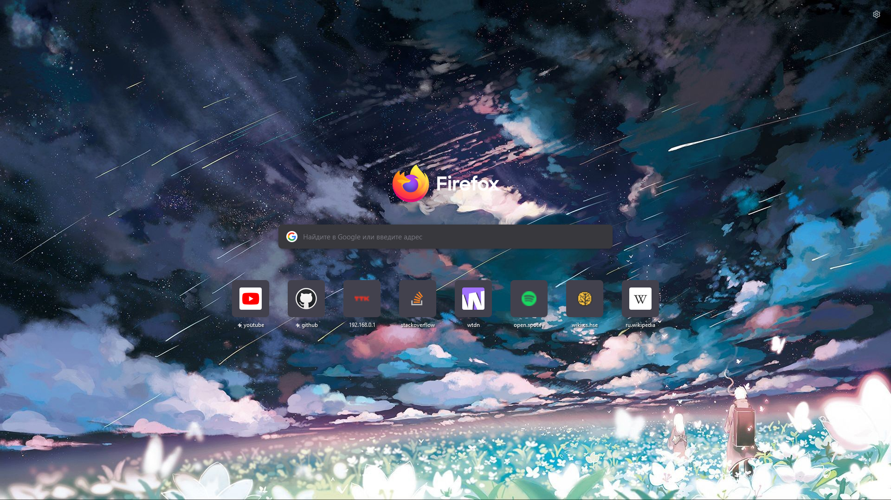

# Background updater of Home page for Mozilla Firefox

## How do I change the background image of Home page in Firefox?
## [Superuser](https://superuser.com/questions/1495946/how-do-i-change-the-background-image-of-home-page-in-firefox)

## You can create an automated task using Task Scheduler.
### Firefox must be reloaded to change an image!

## Build for windows
    .\windowsBuild "Visual Studio 16 2019"
### or using another generator like "Ninja"
    .\windowsBuild "Ninja"

## Build for Linux
    bash linuxBuild.sh
### run 
    cd build
    ./imch

